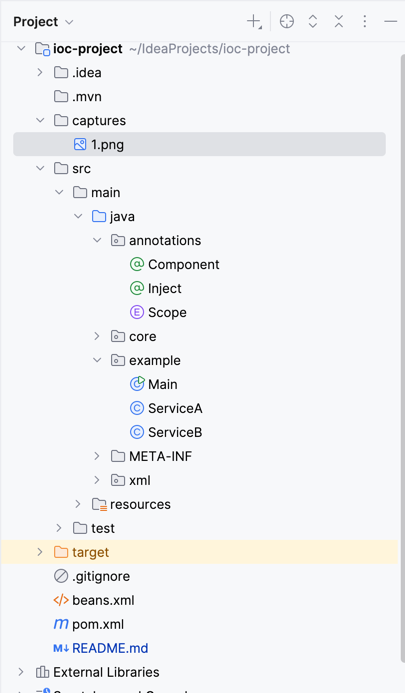

#  Activité Pratique N°1 - Injection des dépendances(IOC)

## Partie I - 

## Partie II  - Mini Projet (Framework Injection des dépendance)

### Structure du projet

### test d'injection

- serviceB est injecté par la methode XML
- serviceA est injecté par annotation

